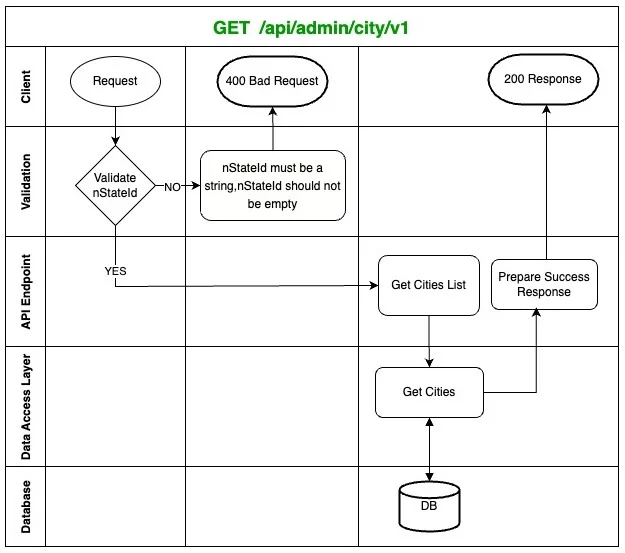
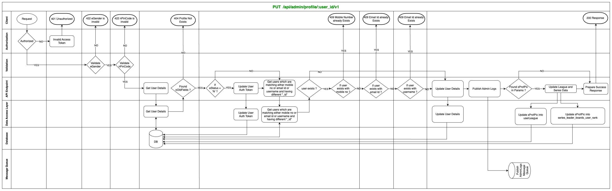

# User Profile Service

"User Profile Service", a micro-service, has been built to handle profile related activities for the SportsBuzz11 application and admin panel.

**Here is an architechtural overview of the system -**

<!--  -->

  
   
  User Profile Service Architechtural Overview

### System Requirements

**We’ll focus on the following set of requirements :**

<ins>For External Users</ins> -
1. The system should support getting the data of a user. The data consists of user's personal data and balances and statistical data.
2. User should have priviledge to update personal data.
3. The system should return the list of states and cities.

<ins>For Admin Users</ins> -
1. The system should support getting the data of a user.The data consists of user's personal data and balances and statistical data.
2. The system should support getting the list of users depending upon some options.
3. The system should return the list of states and cities.
4. Admin users with write access should have priviledge to update a user's data.
5. The system should support getting the referred users list of a user.
6. The system should return the list of recommended users as per the phrase and list size.

### API Flow Diagrams

**Getting a user's details:** Any user can perform this.
 
**Endpoint :** $\textcolor{green}{\textsf{GET}}$ /api/user/profile/v2

    
     
    GET User Details

   

**Getting a user's statistics details:** Any user can perform this.
 
**Endpoint :** $\textcolor{green}{\textsf{GET}}$ /api/user/profile-statistics/v1

    
     
    GET User's Statistics Details

   

**Getting list of states for user:** Any user can perform this.
 
**Endpoint :** $\textcolor{green}{\textsf{GET}}$ /api/user/profile/states/v1?eStatus=y

    
     
    GET List of States for User

   

**Getting list of cities for user:** Any user can perform this.
 
**Endpoint :** $\textcolor{green}{\textsf{GET}}$ /api/user/profile/cities/v1?nStateId=1

    
     
    GET List of Cities for User

   

**Updating a user's details:** Any user can perform this.
 
**Endpoint :** $\textcolor{green}{\textsf{PUT}}$ /api/user/profile/v1

    
     
    Update User's Details by ID

   

**Get Signed URL of a file from s3 Bucket:** Any user can perform this.
 
**Endpoint :** $\textcolor{green}{\textsf{POST}}$ /api/user/profile/pre-signed-url/v1

    
     
    Getting Signed URL of a file from s3 bucket

   

**Get Users List in Admin Panel:** Any admin can perform this.
 
**Endpoint :** $\textcolor{green}{\textsf{GET}}$ /api/admin/profile/v2

    
     
    Get Users List in Admin Panel

   

**Get Users Count in Admin Panel:** Any admin can perform this.
 
**Endpoint :** $\textcolor{green}{\textsf{GET}}$ /api/admin/profile/counts/v1

    
     
    Get Users Count in Admin Panel

   

**Get Recommended Users List in Admin Panel:** Any admin can perform this.
 
**Endpoint :** $\textcolor{green}{\textsf{GET}}$ /api/admin/user/recommendation/v1?nLimit=5

    
     
    Get Recommended Users List in Admin Panel

   

**Getting list of states in Amdin Panel:** Any admin can perform this.
 
**Endpoint :** $\textcolor{green}{\textsf{GET}}$ /api/admin/states/v1?eStatus=y

    
     
    GET List of States in Amdin Panel

   

**Getting list of cities in Amdin Panel:** Any admin can perform this.
 
**Endpoint :** $\textcolor{green}{\textsf{GET}}$ /api/admin/city/v1?nStateId=1

    
     
    GET List of Cities in Amdin Panel

   

**Getting User Details by user ID in Amdin Panel:** Any admin can perform this.
 
**Endpoint :** $\textcolor{green}{\textsf{GET}}$ /api/admin/profile/<user_id>/v1

    
     
    GET User Details by user ID in Amdin Panel

   

**Getting Referred User Details by user ID in Amdin Panel:** Any admin can perform this.
 
**Endpoint :** $\textcolor{green}{\textsf{GET}}$ /api/admin/referred-list/<user_id>/v1

    
     
    GET Referred User Details by user ID in Amdin Panel

   

**Updating User Details by user ID in Amdin Panel:** Admin with write access can perform this.
 
**Endpoint :** $\textcolor{green}{\textsf{PUT}}$ /api/admin/profile/<user_id>/v1

    
     
    Updating User Details by user ID in Amdin Panel

   

**Get Signed URL of a file from s3 Bucket:** Admin with write access can perform this.
 
**Endpoint :** $\textcolor{green}{\textsf{POST}}$ /api/admin/profile/pre-signed-url/v1

    
     
    Getting Signed URL of a file from s3 bucket

### Project Setup
1. git clone
2. run "npm install"
3. install mysql in local machine or run local mysql using docker
4. run "npm run migration" to migrate mysql tables
5. add mysql credentials into "secretManagerSecrets.ts"
6. install redis in local or run redis using docker
7. add redis credentials into "secretManagerSecrets.ts"
8. add mongo db credentials into "secretManagerSecrets.ts"
9. run project using "npm run dev"
10. never push any changes in "secretManagerSecrets.ts"
